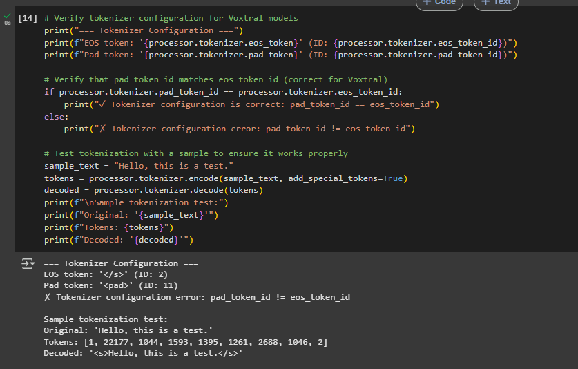
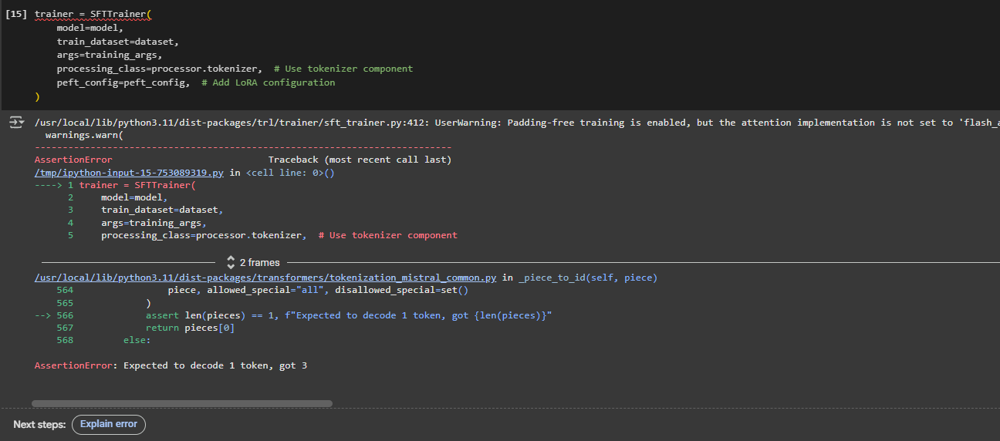
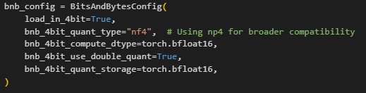
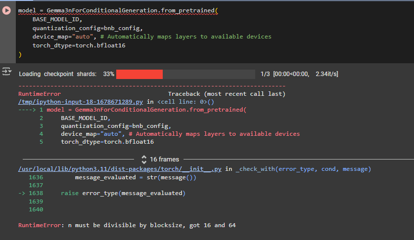
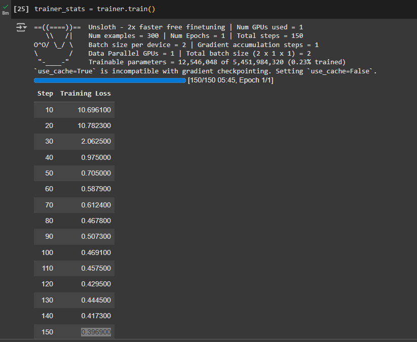
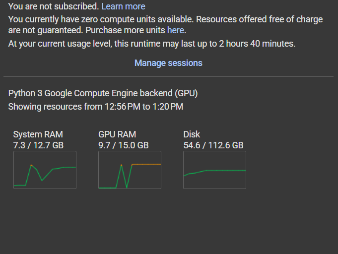

# Bahasa Indonesia Audio Transcription — LoRA Fine-Tune

Fine-tuning a small multimodal LLM to transcribe Bahasa Indonesia speech, under real constraints: no local GPU with enough VRAM, a hard deadline, and a model ecosystem that was actively shifting under me mid-project. This documents the actual engineering process — including the wrong turns — not just the final result.

- **`gemma_lora_finetune_colab.ipynb`** — trains a LoRA adapter on top of a 4-bit quantized `unsloth/gemma-3n-E2B-it-unsloth-bnb-4bit` model using the `mozilla-foundation/common_voice_17_0` Indonesian speech dataset.
- **`inference_lora_colab.ipynb`** — loads the base model + LoRA adapter and runs transcription on a recorded audio file (`inference_audio.mp3`).

Both notebooks are built to run on Google Colab.

## Why LoRA + 4-bit quantization

I used **LoRA** (Low-Rank Adaptation) on top of a **4-bit quantized** base model because of limited GPU RAM (training on Colab's free tier).

- **LoRA** freezes the pretrained weights and injects small trainable low-rank matrices instead of updating every parameter, so training only needs gradients/optimizer state for a small fraction of the model:

  W' = W + AB, where A ∈ ℝ^(d×r), B ∈ ℝ^(r×k), and r ≪ min(d, k)

- **4-bit quantization** cuts the base model's weight precision to 4 bits, roughly halving (or better) its memory footprint while keeping most of its representational power intact.

**Trade-offs:** too low a rank `r` can under-fit and miss fine-tuning nuance; too high a rank approaches full fine-tuning and erodes the memory/compute savings that make LoRA worth using in the first place.

## Engineering process & challenges

I had a few days to produce a working LoRA adapter and an inference pipeline, so I planned to spend the first stretch on training and the rest on inference and write-up.

I initially picked `mistralai/Voxtral-Mini-3B-2507` because it was the newest available model at the time. That turned out to be premature — its tokenizer wasn't fully supported yet, and I hit a persistent `pad_token_id != eos_token_id` error that cost most of two days:

After confirming via the [Mistral tokenization docs](https://docs.mistral.ai/guides/tokenization/) that tokenizer support for that model was incomplete, I switched to `google/gemma-3n-E2B-it`:

That introduced a new problem — out-of-memory errors on Colab, which pushed me toward quantization. The quantized load then failed with an error that looked unrelated to the actual cause:

At the time I assumed it was a `bfloat16` precision issue; in hindsight, the real cause was the model's vocabulary size not being a multiple of 64, which some quantization kernels require. I also tried Whisper as a fallback, but ran into dependency issues with the older codebase.

The fix was finding [Unsloth's](https://github.com/unslothai/unsloth) pre-quantized build of Gemma-3N, which worked with the Common Voice dataset after some adjustments. I trained in two passes — a small subset first to validate the pipeline, then the full dataset for a meaningful adapter:

For inference, the plan was real-time streaming transcription, but local hardware couldn't run the model and Colab doesn't support live microphone input. Rather than burn remaining time on a Colab-specific audio-streaming workaround, I scoped inference down to a pre-recorded audio file — which still demonstrates the core result: the fine-tuned model transcribing Bahasa Indonesia speech at acceptable latency.

### If I had real-time constraints and better hardware

- **Fixed-length segmentation** — chunk incoming audio into short frames (1-2s).
- **Overlap & buffering** — 200-300ms overlap between chunks to avoid cutting words at boundaries.
- **Sequential inference** — process each chunk as it arrives and stitch partial transcripts into a continuous stream.

### What a production version would need

- Hardware with enough RAM/VRAM to hold the full model and run inference without falling back to aggressive quantization or CPU offload.
- A real audio-capture pipeline (PyAudio/PortAudio/WebRTC) for live microphone or telephony input, rather than file-based batch processing.

## Tech stack

Python · PyTorch · Hugging Face Transformers · [Unsloth](https://github.com/unslothai/unsloth) · PEFT/LoRA · 4-bit quantization (bitsandbytes) · Google Colab
